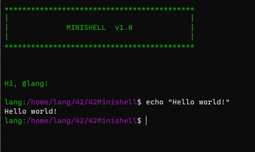

# 42Minishell
The existence of shells is linked to the very existence of IT. At the time, all developers agreed that communicating with a computer using aligned 1/0 switches was seriously irritating. It was only logical that they came up with the idea of creating a software to communicate with a computer using interactive lines of commands in a language somewhat close to the human language. Thanks to Minishell, we’ll be able to travel through time and come back to problems people faced when Windows didn’t exist.

## Use:

🚧 project:<br/>
```
42Minishell $ make
```
🚿 Clean Obj files:<br/>
```
42Minishell $ make clean
```
🚿 🚿 Clean All (obj files + binary):<br/>
```
42Minishell $ make fclean
```
🚿 🚿 🚧 Clean All + build:<br/>
```
42Minishell $ make re
```
🏍 RUN:<br/>
```
42Minishell $ ./minishell
```



Enjoy!<br/>
